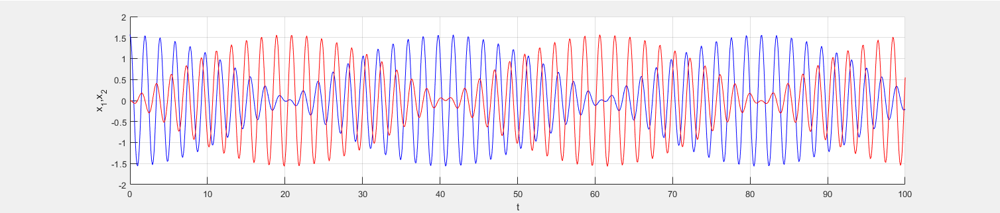

# Simulation of two coupled harmonic oscillators on MatLab
Code for graphing and simulating two coupled harmonic oscillators.  
MatLab version: R2019a
[Animation](https://www.youtube.com/watch?v=ma00aACj014&feature=youtu.be)

